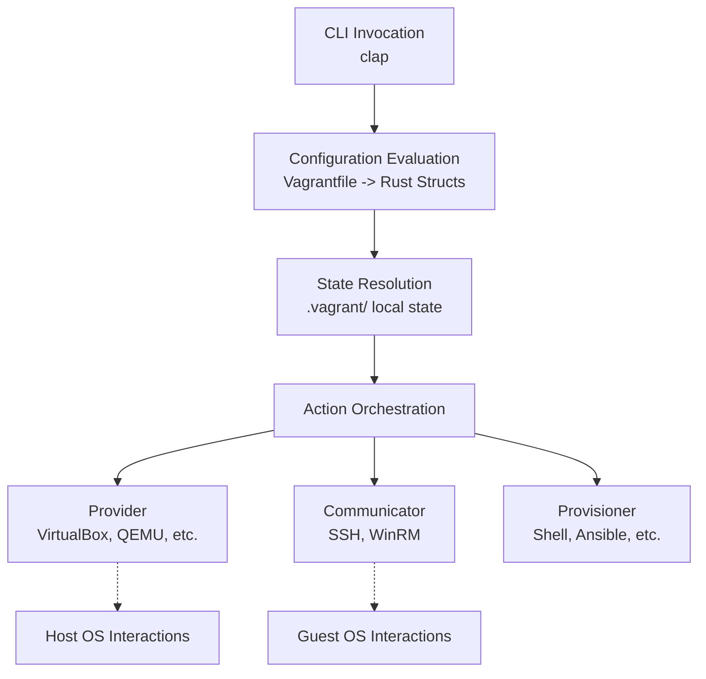

# Migratory Architecture

This document describes the high-level architecture of Migratory, a Rust-based, 100% compatible replica of Vagrant.

## High-Level Design

Migratory is built as a modular, statically-typed monolith. It is composed of several strongly decoupled domains, glued together by the core CLI router and the Configuration evaluator.

The core architecture follows this execution flow:
1. **CLI Invocation:** `clap` parses user commands.
2. **Configuration Evaluation:** The `Vagrantfile` is evaluated into a strongly typed `EnvironmentConfig`.
3. **State Resolution:** `.vagrant/` local state is read to map abstract configurations to concrete hypervisor IDs.
4. **Action Orchestration:** The requested action (e.g., `up`, `destroy`) delegates to the appropriate Provider, Communicator, and Provisioner implementations.

## Module Map

### 1. `cli`
Handles argument parsing and command routing using the `clap` crate. Commands are modeled as an exhaustive enum (`Commands`), ensuring all CLI arguments are type-checked at compile time.

### 2. `config`
This is the heart of Vagrantfile compatibility. It defines strictly-typed structs representing the evaluated state of a Vagrantfile:
* `VagrantConfig` (Global settings, plugins)
* `VmConfig` (Box details, hostname, networks, providers, provisioners)
* `SshConfig` / `WinrmConfig` (Communication details)
* `EnvironmentConfig` (Multi-machine environments)

*Note on Vagrantfiles:* Pre-BSL Vagrant uses a Ruby DSL. Migratory bridges this by evaluating the Ruby DSL and marshalling it into these Rust structs (currently modeled as an out-of-process evaluation bridge).

### 3. `provider`
The interface to hypervisors. The core `Provider` trait enforces a standard contract: `up`, `halt`, `destroy`, `status`.
* **State Management:** The `StateManager` struct handles reading/writing hypervisor IDs to `.vagrant/machines/<name>/id`.
* **Implementations:** Scaffolds exist for VirtualBox (`VBoxManage`), QEMU (`virsh`), VMware (`vmrun`), and Hyper-V (`powershell`). Shell executions are wrapped safely to capture stdout/stderr.

### 4. `communicator`
Handles executing commands inside the guest VM and transferring files.
* **SSH:** Wraps standard `ssh` / `scp` binaries (or native bindings) targeting Linux/BSD guests.
* **WinRM:** Handles HTTP/HTTPS execution targeted at Windows guests.

### 5. `provisioner`
Defines the `Provisioner` trait (`prepare`, `provision`, `cleanup`).
* Supports `shell`, `file`, `ansible`, `chef`, `puppet`, and `docker`.
* Provisioners utilize the `Communicator` to run their logic mutably against the Guest VM.

### 6. `network` & `synced_folder`
* **Network:** Models Forwarded Ports, Private Networks, and Public Networks. Includes logic for auto-correcting port collisions based on the host's current open ports.
* **Synced Folder:** The `SyncedFolder` trait defines `prepare` (host-side) and `mount` (guest-side). Implementations include VirtualBox Shared Folders, `rsync`, NFS, and SMB.

### 7. `host` & `guest`
Abstracts OS-specific capabilities.
* **Host:** Logic running on the user's machine (e.g., modifying `/etc/exports` for NFS on macOS/Linux, or creating SMB shares on Windows).
* **Guest:** Logic running inside the VM via the Communicator (e.g., changing the hostname, configuring network adapters, mounting synced folders). The `detect_guest` function automatically probes the VM to dynamically load `LinuxGuest`, `WindowsGuest`, or `BsdGuest`.

### 8. `cloud` & `box_manager`
* **Cloud:** A lightweight REST client (using `reqwest`) targeting the Vagrant Cloud API (`app.vagrantup.com/api/v2`) to resolve box metadata, versioning, and download URLs.
* **Box Manager:** Handles the safe unpacking of `.box` files (which are tar/gzip archives) into the local `~/.vagrant.d/boxes` cache using Rust-native `tar` and `flate2` crates.

### 9. `plugin`
A dynamic registry for extending Migratory. Defines a `Plugin` trait that allows third-party code to hook into the lifecycle (e.g., adding custom provisioners or UI extensions).

### 10. `ui`
Terminal output formatting using `indicatif` and `colored`.
* `ConsoleUi`: Mimics Vagrant's prefix-based, colorized output (`==> default: Message`).
* `MachineReadableUi`: Mimics Vagrant's `--machine-readable` CSV output for IDE integrations.

### 11. `error`
Migratory maintains a strict **zero unwrap** policy in core logic. All errors route to the `MigratoryError` enum, generated using the `derive_more` crate for zero-overhead `From` conversions. This eliminates the need for dynamic boxed errors like `anyhow`, ensuring all error scenarios are strongly typed and exhaustive.