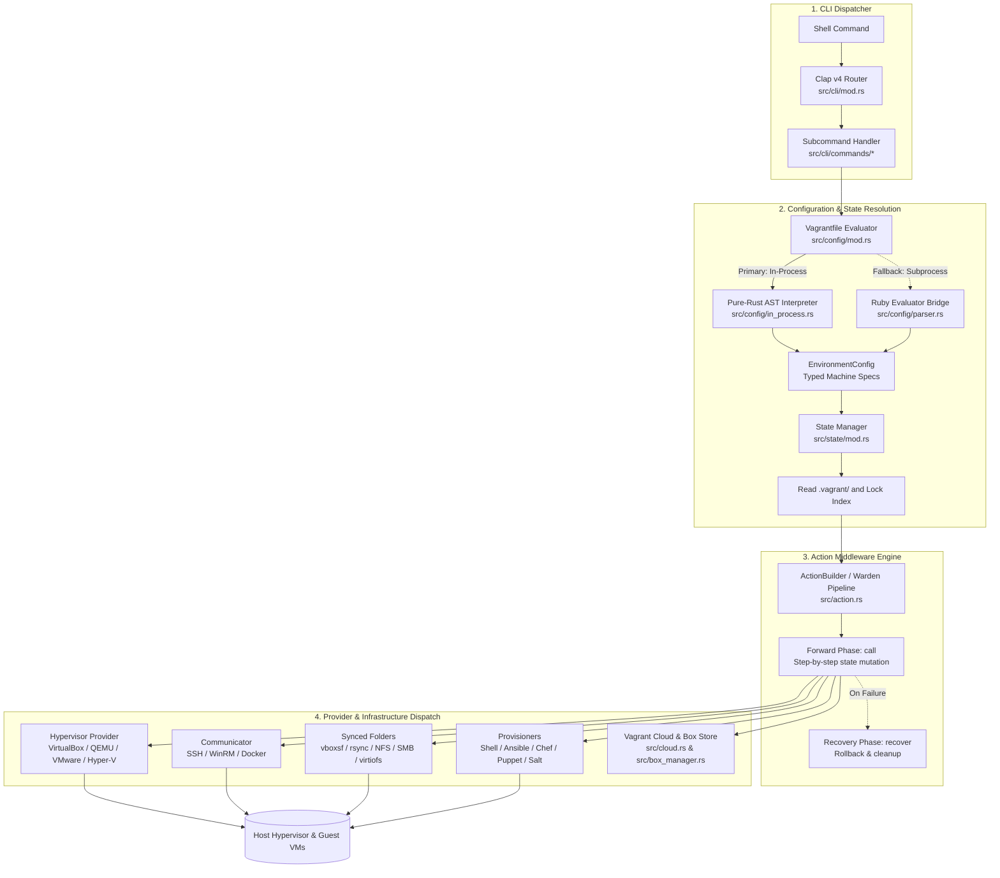
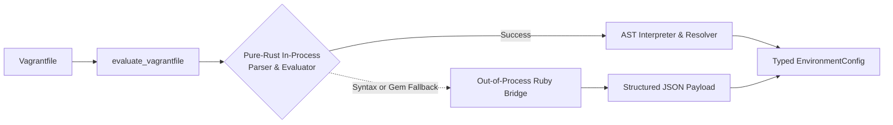
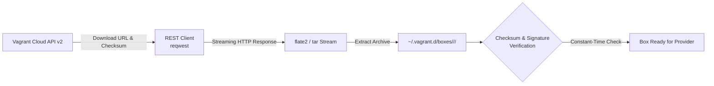

# Migratory Architecture

This document provides a comprehensive technical specification of Migratory's internal architecture, execution model, subsystem contracts, and safety guarantees.

---

## Table of Contents

- [Architectural Philosophy & Principles](#architectural-philosophy--principles)
- [System Overview & Execution Flow](#system-overview--execution-flow)
- [Action Middleware Engine (Warden Pipeline)](#action-middleware-engine-warden-pipeline)
- [Configuration Engine & DSL Evaluation](#configuration-engine--dsl-evaluation)
- [Local & Global State Management](#local--global-state-management)
- [Hypervisor Providers](#hypervisor-providers)
- [Communicators & Remote Execution](#communicators--remote-execution)
- [Provisioner Subsystem](#provisioner-subsystem)
- [Synced Folders & Filesystem Synchronization](#synced-folders--filesystem-synchronization)
- [Virtual Networking & Port Collision Detection](#virtual-networking--port-collision-detection)
- [Host & Guest OS Abstractions](#host--guest-os-abstractions)
- [Box Storage & Vagrant Cloud Client](#box-storage--vagrant-cloud-client)
- [UI & Output Streaming Architecture](#ui--output-streaming-architecture)
- [Security Model & Timing Safeguards](#security-model--timing-safeguards)
- [Error Hierarchy & Zero-Panic Policy](#error-hierarchy--zero-panic-policy)

---

## Architectural Philosophy & Principles

Migratory is engineered from the ground up to replace legacy Ruby-based Vagrant with a modern, memory-safe, and high-performance Rust foundation:

1. **Modular Monolith:** All core subsystems (CLI, configuration evaluator, action pipeline, providers, provisioners, communicators, and cloud client) are compiled into a single static binary with no external runtime dependencies.
2. **Deterministic State Transitions:** Operations follow a strict two-phase middleware pipeline (the Warden pattern). Every action that mutates external system state implements an explicit rollback/recovery mechanism.
3. **Pure-Rust First with Graceful Fallback:** `Vagrantfile` evaluation is handled directly in-process by a native Rust AST parser and interpreter, eliminating the Ruby runtime requirement for standard environments while preserving an out-of-process Ruby fallback bridge for complex legacy scripts.
4. **Zero-Panic Safety Guarantee:** The codebase enforces `#![deny(clippy::unwrap_used)]`, `#![deny(clippy::expect_used)]`, and `#![deny(clippy::panic)]`. Every error path is exhaustively typed through `MigratoryError`.
5. **Cross-Process Synchronization:** Concurrent operations against the shared `.vagrant/` directory and `~/.vagrant.d/` box cache are protected using advisory file locks (`fd-lock`).
6. **Side-Channel Resistant Cryptography:** Sensitive comparison operations (such as API token validation and box signature checks) use constant-time algorithms to prevent timing-based side-channel vulnerabilities.

---

## System Overview & Execution Flow

When a user executes a `migratory` command, the request moves through four distinct architectural stages:



---

## Action Middleware Engine (Warden Pipeline)

Core virtual machine workflows (such as `up`, `halt`, `reload`, `destroy`, and `provision`) are orchestrated through an Action/Middleware engine located in `src/action.rs`. This architecture directly mirrors Vagrant's internal Warden design.

### Action Trait

Each step in an operation implements the `Action` trait:

```rust
pub trait Action: Send + Sync {
    /// Identifier for logging and pipeline manipulation.
    fn name(&self) -> &str;

    /// Forward execution phase.
    fn call(&self, env: &mut Environment) -> Result<ActionResult, MigratoryError>;

    /// Reverse recovery/rollback phase invoked if a subsequent action fails.
    fn recover(&self, env: &mut Environment, error: &MigratoryError) -> Result<(), MigratoryError> {
        Ok(())
    }
}
```

### Shared Environment

Actions communicate through a shared `Environment` context:
* `data: HashMap<String, String>`: Lightweight key-value string flags.
* `typed_data: HashMap<String, Arc<dyn Any + Send + Sync>>`: Strongly-typed downcastable state objects (such as active `Provider` instances, `Communicator` handles, or network configurations).

### Pipeline Manipulation

The `ActionBuilder` allows dynamic middleware stack composition:
* `use_action(action)`: Appends an action to the end of the chain.
* `prepend(action)`: Places an action at the beginning of the chain.
* `insert_before(target_name, action)`: Injects an action immediately prior to a designated step.
* `insert_after(target_name, action)`: Injects an action immediately following a designated step.
* `replace(target_name, action)`: Replaces a middleware step.
* `delete(target_name)`: Removes a step from the execution chain.

---

## Configuration Engine & DSL Evaluation

Vagrant relies on a Ruby Domain Specific Language (DSL). Migratory provides a two-tiered evaluation strategy in `src/config/`:



### 1. In-Process Pure-Rust Evaluator (`src/config/in_process.rs`)
* Tokenizes and parses Ruby-style configuration blocks without launching an external Ruby interpreter.
* Evaluates dynamic constructs:
  * Loops: `(1..3).each do |i| ... end`
  * String interpolation: `"web-#{i}"`, `"192.168.56.#{10 + i}"`
  * Conditionals: `if / else / end`
  * Environment variable access: `ENV['VAR_NAME']`
  * Hash and array manipulation.
* Implements semantic version comparison (`compare_semver`) to resolve box version constraints.

### 2. Ruby Out-of-Process Fallback Bridge (`src/config/parser.rs`)
* If a `Vagrantfile` imports arbitrary Ruby gems or invokes complex native code that cannot be resolved in-process, Migratory executes a bundled Ruby helper script.
* The script builds mock Ruby DSL objects, captures all configuration calls, and serializes the resulting graph into a JSON payload parsed by `serde_json` into native Rust structs.
* Can be disabled entirely via `MIGRATORY_FORCE_PURE_RUST=1`.

### Typed Configuration Structs
The evaluated configuration is mapped into strongly-typed structures:
* `EnvironmentConfig`: The complete multi-machine project definition.
* `MachineConfig`: Configuration for an individual machine (box, hostname, guest OS, network adapters, synced folders, providers, provisioners).
* `NetworkConfig`: Forwarded ports, private IP definitions, and bridged network cards.
* `SyncedFolderConfig`: Source host path, guest mount point, mount options, and synchronization driver.

---

## Local & Global State Management

State persistence is handled in `src/state/`:

### Project State (`.vagrant/`)
Inside each project directory, Migratory maintains:
* `.vagrant/machines/<machine_name>/<provider>/id`: Stores the hypervisor's unique virtual machine identifier (e.g. VirtualBox UUID or libvirt domain name).
* `.vagrant/machines/<machine_name>/<provider>/action_provision`: Marker file indicating whether provisioners have previously run.
* `.vagrant/machines/<machine_name>/<provider>/synced_folders`: Persisted state of active directory mounts.

### Global State (`~/.vagrant.d/`)
* `~/.vagrant.d/boxes/`: Local repository of downloaded box archives unpacked by provider and version:
  ```text
  ~/.vagrant.d/boxes/
  └── ubuntu-VAGRANTSLASH-jammy64/
      └── 20240101.0.0/
          └── virtualbox/
              ├── Boxfile
              ├── metadata.json
              └── box.ovf
  ```
* `~/.vagrant.d/data/machine-index/index`: Global registry mapping all machine UUIDs, paths, and provider types for `migratory global-status`.

### File Locking Architecture
To prevent race conditions during concurrent command execution:
* Every modification to `.vagrant/` or `~/.vagrant.d/data/machine-index/` acquires an advisory file lock using `fd-lock`.
* File locks are automatically released upon process exit or when the lock guard drops out of scope.

---

## Hypervisor Providers

The `Provider` trait (`src/provider/mod.rs`) defines the contract that all virtualization backends must satisfy:

```rust
pub trait Provider: Send + Sync {
    fn up(&self, config: &MachineConfig) -> Result<(), MigratoryError>;
    fn halt(&self, force: bool) -> Result<(), MigratoryError>;
    fn suspend(&self) -> Result<(), MigratoryError>;
    fn resume(&self) -> Result<(), MigratoryError>;
    fn destroy(&self) -> Result<(), MigratoryError>;
    fn status(&self) -> Result<MachineStatus, MigratoryError>;
    fn snapshot_save(&self, name: &str) -> Result<(), MigratoryError>;
    fn snapshot_restore(&self, name: &str) -> Result<(), MigratoryError>;
    fn snapshot_delete(&self, name: &str) -> Result<(), MigratoryError>;
    fn snapshot_list(&self) -> Result<Vec<String>, MigratoryError>;
}
```

### Supported Implementations

1. **VirtualBox (`src/provider/virtualbox.rs`):**
   * Communicates with Oracle VirtualBox using `VBoxManage`.
   * Manages VM registration, CPU/RAM configuration, storage controller attachment, forwarded ports, and linked clones (`VAGRANT_VBOX_LINKED_CLONE`).
2. **QEMU / KVM (`src/provider/qemu.rs`):**
   * Integrates with `virsh` and `libvirt` for accelerated Linux virtualization.
   * Generates dynamic domain XML definitions and manages `qemu-img` copy-on-write overlays (`qcow2`).
3. **VMware (`src/provider/vmware.rs`):**
   * Interfaces with VMware Workstation and VMware Fusion using `vmrun`.
   * Parses and modifies `.vmx` virtual machine configuration files directly.
4. **Hyper-V (`src/provider/hyperv.rs`):**
   * Uses native PowerShell cmdlets (`Start-VM`, `Stop-VM`, `Get-VMNetworkAdapter`) on Windows hosts.
5. **Docker (`src/provider/docker.rs`):**
   * Interacts directly with the Docker Engine daemon to manage containerized machines.

---

## Communicators & Remote Execution

Communicators (`src/communicator/mod.rs`) manage communications between the host and guest:

```rust
pub trait Communicator: Send + Sync {
    fn execute(&self, command: &str) -> Result<ExecutionResult, MigratoryError>;
    fn upload(&self, local_path: &Path, remote_path: &Path) -> Result<(), MigratoryError>;
    fn download(&self, remote_path: &Path, local_path: &Path) -> Result<(), MigratoryError>;
    fn ready(&self) -> Result<bool, MigratoryError>;
}
```

* **SSH Communicator (`src/communicator/ssh.rs`):**
  * Employs native `ssh2` Rust bindings for high-performance in-process execution and file transfer via SCP/SFTP.
  * Falls back to standard system OpenSSH when pseudo-terminal allocation (PTY) is required for interactive shell sessions.
  * Handles default insecure Vagrant key replacement on initial machine initialization.
* **WinRM Communicator (`src/communicator/winrm.rs`):**
  * Dispatches HTTP/HTTPS SOAP requests targeting Windows Remote Management (ports 5985/5986).
  * Executes Base64-encoded PowerShell scripts inside the Windows guest and captures exit codes and output streams.
* **Docker Communicator (`src/communicator/docker.rs`):**
  * Dispatches commands directly via `docker exec`.

---

## Provisioner Subsystem

The `Provisioner` trait (`src/provisioner/mod.rs`) abstracts software orchestration:

```rust
pub trait Provisioner: Send + Sync {
    fn prepare(&mut self, env: &Environment) -> Result<(), MigratoryError>;
    fn provision(&self, communicator: &dyn Communicator) -> Result<(), MigratoryError>;
    fn cleanup(&self) -> Result<(), MigratoryError>;
}
```

* **Shell (`src/provisioner/shell.rs`):** Uploads and executes inline or file-based scripts (`.sh`, `.ps1`) with configurable privileges and environment arguments.
* **Ansible (`src/provisioner/ansible.rs`):** Supports running playbooks from the host (`ansible-playbook`) or provisioning directly inside the guest VM (`ansible_local`) with auto-generated inventory files.
* **Chef (`src/provisioner/chef.rs`):** Manages Chef Solo, Chef Zero, and Chef Client runs, formatting node JSON and run lists.
* **Puppet (`src/provisioner/puppet.rs`):** Orchestrates standalone Puppet Apply manifests or integrates with a remote Puppet Agent master.
* **Salt (`src/provisioner/salt.rs`):** Coordinates Salt Minion highstate runs and masterless configurations.
* **Docker (`src/provisioner/docker.rs`):** Pulls container images and coordinates `docker compose` deployments inside the guest.
* **File (`src/provisioner/file.rs`):** Transfers files and directories from host to guest.

---

## Synced Folders & Filesystem Synchronization

The `SyncedFolder` trait (`src/synced_folder/mod.rs`) controls host-to-guest folder sharing:

* **VirtualBox Shared Folders (`vboxsf`):** Mounts host folders using VirtualBox guest additions.
* **Rsync & `rsync-auto` (`src/synced_folder/rsync.rs`):** Uses the `notify` crate to hook into kernel filesystem event systems (`inotify` on Linux, `kqueue`/`FSEvents` on macOS, `ReadDirectoryChangesW` on Windows) for instantaneous real-time file replication.
* **NFS (`src/synced_folder/nfs.rs`):** Interacts with host `/etc/exports` (prompting for administrative elevation when required) and orchestrates guest mount operations.
* **SMB (`src/synced_folder/smb.rs`):** Coordinates Windows CIFS network shares.
* **VirtioFS (`src/synced_folder/virtiofs.rs`):** Configures memory-mapped shared filesystems for modern QEMU/KVM virtual machines.

---

## Virtual Networking & Port Collision Detection

Network orchestration in `src/network/` supports three primary topologies:
1. **Forwarded Ports:** Exposes guest TCP/UDP services onto host ports.
   * **Collision Detection Engine:** Scans active host ports prior to VM startup. If a collision is detected on a requested host port, Migratory automatically remaps the port to an available socket within the configured `usable_port_range` (default: 2200–2250).
2. **Private (Host-Only) Networks:** Establishes isolated virtual network adapters with static IP assignments or host-managed DHCP.
3. **Public (Bridged) Networks:** Bridges guest virtual NICs directly to physical host network adapters.

---

## Host & Guest OS Abstractions

OS differences are isolated across two capability layers:

### Host Subsystem (`src/host/`)
Handles operations executed directly on the host machine:
* `darwin.rs`: macOS-specific networking and NFS exports.
* `linux.rs`: Linux `/etc/exports`, systemd services, and bridge interfaces.
* `windows.rs`: Windows PowerShell execution, SMB configuration, and firewall rules.
* `bsd.rs`: BSD-family filesystem and network configurations.

### Guest Subsystem (`src/guest/`)
Dispatches OS configuration commands into the guest via the active `Communicator`:
* Dynamically detects guest operating system via `/etc/os-release`, package managers, or Windows registry markers.
* Configures static and DHCP network interfaces across Debian/Ubuntu (`netplan`, `/etc/network/interfaces`), RHEL/CentOS (`nmcli`), Arch Linux, and Windows (`netsh`).
* Sets machine hostnames and manages `/etc/hosts`.
* Executes guest mounting scripts for synced folders.

---

## Box Storage & Vagrant Cloud Client

The box management pipeline (`src/cloud.rs` and `src/box_manager.rs`) oversees artifact lifecycle:



* **Vagrant Cloud REST Client:** Resolves box metadata, versioning matrices, and direct download links from `app.vagrantup.com/api/v2`.
* **Streaming Extraction:** Downloads and extracts `.box` tar/gzip archives in a single streaming pass using `flate2` and `tar`, minimizing disk thrashing and temporary file allocations.
* **Cryptographic Integrity:** Validates SHA256, SHA1, and MD5 hashes using constant-time comparisons.
* **Format Mutation (`src/cli/commands/mutate.rs`):** Translates box disk images (such as converting VMDK to QCOW2) across provider formats.

---

## UI & Output Streaming Architecture

Located in `src/ui/`, Migratory supports two output rendering engines:

1. **`ConsoleUi`:**
   * Human-readable terminal interface.
   * Color-coded machine prefixes: `==> <machine_name>: <message>`.
   * Integrates `indicatif` progress spinners and bars during box downloads and disk operations.
2. **`MachineReadableUi`:**
   * Emits comma-separated value (CSV) streams:
     ```text
     <timestamp>,<target_machine>,<event_type>,<arguments...>
     ```
   * Enables seamless, headless integration into third-party IDE plugins, CI/CD pipelines, and wrapper scripts.

---

## Security Model & Timing Safeguards

1. **Constant-Time Cryptographic Equality (`src/lib.rs`):**
   * The `constant_time_compare` function ensures that token comparisons and hash verifications run in constant time relative to string length:
     ```rust
     pub fn constant_time_compare(a: &str, b: &str) -> bool {
         let a_bytes = a.as_bytes();
         let b_bytes = b.as_bytes();
         if a_bytes.len() != b_bytes.len() {
             return false;
         }
         let mut diff = 0u8;
         for (&x, &y) in a_bytes.iter().zip(b_bytes.iter()) {
             diff |= x ^ y;
         }
         diff == 0
     }
     ```
   * Eliminates timing side-channel attacks when validating secrets or cloud authentication tokens.
2. **Sanitized Subprocess Invocations:**
   * External tools (`VBoxManage`, `virsh`, `vmrun`, `ssh`) are invoked using explicit argument arrays (`std::process::Command`), preventing shell injection vulnerabilities.
3. **No Unsafe Code:**
   * The codebase contains zero `unsafe` blocks in business logic.

---

## Error Hierarchy & Zero-Panic Policy

Migratory strictly rejects dynamic, untyped error boxes (such as `anyhow`). All error conditions map to an exhaustive, strongly typed enum (`src/error.rs`):

```rust
#[derive(Debug, Display)]
pub enum MigratoryError {
    #[display("Box error: {_0}")]
    BoxError(String),
    #[display("Provider error: {_0}")]
    ProviderError(String),
    #[display("Communicator error: {_0}")]
    CommunicatorError(String),
    #[display("Configuration error: {_0}")]
    ConfigError(String),
    #[display("I/O error: {_0}")]
    Io(std::io::Error),
    #[display("Network error: {_0}")]
    Network(reqwest::Error),
    #[display("State error: {_0}")]
    StateError(String),
    #[display("Not found: {_0}")]
    NotFound(String),
    #[display("Generic error: {_0}")]
    Generic(String),
}
```

* **Zero Panic Policy:** The compiler enforces `#![deny(clippy::unwrap_used)]`, `#![deny(clippy::expect_used)]`, and `#![deny(clippy::panic)]`. Every fallible operation must propagate errors via Rust's `Result` type.
* **100% Quality Enforced in CI:** Every pull request requires 100% documentation coverage (`cargo rustdoc -- -D missing_docs`) and 100% line/branch test coverage (`cargo tarpaulin --fail-under 100 --engine llvm`).
