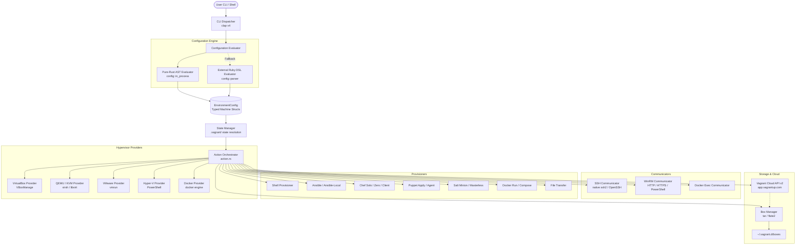

Migratory (Vagrant reimplementation; open-source)
=================================================

[](https://opensource.org/licenses/Apache-2.0)
[]()
[]()
[](https://github.com/SamuelMarks/migratory/actions)

**Migratory** is an uncompromising, 100% drop-in compatible, open-source replica of [HashiCorp Vagrant](https://github.com/hashicorp/vagrant) (pre-BSL), written from the ground up in modern, memory-safe Rust. It provides the exact same developer workflow, CLI commands, machine-readable output, and `Vagrantfile` configuration syntax as [HashiCorp Vagrant](https://github.com/hashicorp/vagrant), but with instant cold starts, zero runtime dependencies, and a bulletproof execution model.

> **Related Ecosystem Projects:**
> - [Stamp](https://github.com/SamuelMarks/stamp): An open-source, high-performance reimplementation of HashiCorp Packer in pure Rust.
> - [hashicorp-configuration-rs](https://github.com/SamuelMarks/hashicorp-configuration-language-rs) (`hashicorp-configuration-language-rs`): A native Rust HCL2 parsing, evaluation, and decoding engine powering HashiCorp configuration formats across the ecosystem.

---

## Table of Contents

- [Vision & Motivation](#vision--motivation)
- [Why Migratory?](#why-migratory)
- [Core Architectural Tenets](#core-architectural-tenets)
- [System Architecture](#system-architecture)
- [Supported Providers](#supported-providers)
- [Supported Provisioners](#supported-provisioners)
- [Synced Folders & Filesystems](#synced-folders--filesystems)
- [Communicators & Remote Access](#communicators--remote-access)
- [Box Management & Vagrant Cloud](#box-management--vagrant-cloud)
- [Networking & Port Management](#networking--port-management)
- [Guest & Host OS Support](#guest--host-os-support)
- [UI & Output Modes](#ui--output-modes)
- [Getting Started](#getting-started)
  - [Prerequisites](#prerequisites)
  - [Pre-Built Binaries](#pre-built-binaries)
  - [Building from Source](#building-from-source)
  - [Shell Autocompletion](#shell-autocompletion)
  - [Quick Start Walkthrough](#quick-start-walkthrough)
- [Vagrantfile Examples](#vagrantfile-examples)
  - [Basic Single-VM Setup](#basic-single-vm-setup)
  - [Multi-Machine Web & Database Setup](#multi-machine-web--database-setup)
- [CLI Command Matrix](#cli-command-matrix)
- [Environment Variables](#environment-variables)
- [Development & Quality Standards](#development--quality-standards)
- [References](#references)
- [License](#license)

---

## Vision & Motivation

On August 10, 2023, HashiCorp announced that it was transitioning all future releases of its core product suite from the open-source Mozilla Public License v2.0 (MPL 2.0) to the Business Source License v1.1 (BSL 1.1) [^dadgar2023][^hashicorp-faq]. Under the BSL 1.1, the original [HashiCorp Vagrant](https://github.com/hashicorp/vagrant) project [^vagrant-bsl] is no longer open-source under the Open Source Initiative (OSI) definition, placing commercial and competitive restrictions on embedded and hosted deployments. This transition left the broader open-source community, continuous integration pipelines, and development teams worldwide facing restrictive licensing on foundational developer tooling.

Migratory was created to ensure that reproducible, declarative development environments remain free, modern, and open forever under permissive licensing (CC0, MIT, or Apache-2.0). Together with sister projects such as [Stamp](https://github.com/SamuelMarks/stamp) (Packer reimplementation) and [hashicorp-configuration-rs](https://github.com/SamuelMarks/hashicorp-configuration-language-rs) (HCL2 configuration engine), Migratory is not an experimental wrapper or an incomplete partial port: it is engineered to be a true **drop-in replacement**:

```bash
alias vagrant="migratory"
vagrant up
```

Your existing `Vagrantfile` definitions, box caches, scripts, and CI/CD workflows work out of the box without alteration.

---

## Why Migratory?

| Feature | [HashiCorp Vagrant](https://github.com/hashicorp/vagrant) | Migratory |
| :--- | :--- | :--- |
| **Licensing** | Business Source License (BSL 1.1) [^dadgar2023][^vagrant-bsl] | Permissive Open-Source (CC0 / Apache-2.0 / MIT) |
| **Host Dependencies** | Requires Ruby runtime, rubygems, bundler, C compilers | **Single static binary**, zero host dependencies |
| **Vagrantfile Parsing** | Slow Ruby interpreter spin-up | **Pure-Rust in-process AST parser & evaluator** (with Ruby fallback) |
| **Startup Overhead** | Multi-second startup latency on every CLI call | Sub-millisecond cold start |
| **Safety Guarantees** | Runtime dynamic exceptions and unhandled crashes | **Zero-panic guarantee** (`#![deny(clippy::unwrap_used)]`), strongly typed error hierarchy |
| **Quality Guarantees** | Best-effort test coverage | **100% Test Coverage & 100% Documentation Coverage** enforced in CI |
| **Format Compatibility** | Standard pre-BSL Ruby DSL | 100% compatible with Vagrant 1.x and 2.x DSLs |
| **Output Formats** | Colorized console & machine-readable CSV | Identical colorized UI and `--machine-readable` CSV stream |

---

## Core Architectural Tenets

1. **Permissive Open-Source Guarantee:** Released under CC0, Apache-2.0, or MIT licenses. Migratory will never be relicensed under restrictive terms.
2. **Pure-Rust In-Process Evaluator:** Contains an in-process pure-Rust parser and evaluator for `Vagrantfile` DSLs (supporting loops, string interpolation, conditionals, dynamic variables, and nested configuration blocks), eliminating the requirement for an external Ruby interpreter. Out-of-process evaluation is retained as an automated fallback for arbitrary Ruby code. Evaluator models are engineered to seamlessly interoperate with the [hashicorp-configuration-rs](https://github.com/SamuelMarks/hashicorp-configuration-language-rs) ecosystem.
3. **Rust-Native Performance:** Instant CLI response times, low memory overhead, concurrent provisioning actions, and thread-safe lock management.
4. **Zero-Panic Execution Safety:** The entire codebase strictly enforces `#![deny(clippy::unwrap_used)]`, `#![deny(clippy::expect_used)]`, and `#![deny(clippy::panic)]`. Errors are exhaustively modeled in a centralized `MigratoryError` enum using `derive_more` for type-safe, zero-overhead propagation.
5. **Multi-Platform Single Binaries:** Pre-compiled, statically linked binaries are produced for Linux (x86_64, AArch64), macOS (Intel, Apple Silicon), and Windows.
6. **Timing Attack Protection:** Critical security routines (such as API token verification and signature comparisons) utilize constant-time comparison algorithms to prevent side-channel leakage.

---

## System Architecture

Migratory is engineered as a modular, statically-typed architecture where CLI handling, configuration evaluation, state persistence, hypervisor providers, communicators, and provisioners operate with strong decoupling.



### Module Responsibilities

* **`cli`**: Compile-time validated command-line parsing and dispatching using `clap` with full flag and subcommand parity.
* **`config`**: Strongly-typed Rust models (`EnvironmentConfig`, `MachineConfig`, `VmConfig`, `NetworkConfig`, `ProviderConfig`, `ProvisionerConfig`, `SyncedFolderConfig`) evaluated either directly in-process or through an out-of-process Ruby bridge.
* **`state`**: Local directory tracking (`.vagrant/machines/<name>/<provider>/id`) to map logical machines to active hypervisor instances.
* **`provider`**: Hypervisor abstractions implementing the `Provider` trait (`up`, `halt`, `suspend`, `resume`, `destroy`, `status`, `snapshot`).
* **`communicator`**: Abstraction for executing commands and streaming data into the guest system (`execute`, `upload`, `download`).
* **`provisioner`**: Automates machine software installation and configuration (`prepare`, `provision`, `cleanup`).
* **`synced_folder`**: Host-guest directory synchronization engines (`prepare`, `mount`).
* **`network`**: Manages forwarded ports, private host-only subnets, and public bridged adapters, including automated port conflict resolution.
* **`guest` & `host`**: OS-specific capability dispatching for Linux, Windows, macOS, and BSD systems.
* **`cloud` & `box_manager`**: Vagrant Cloud API v2 client and native tar/gzip box archive extraction engine.
* **`ui`**: Output formatting supporting both interactive colorized console output and structured machine-readable CSV.

---

## Supported Providers

Migratory interfaces directly with hypervisors via native APIs and standard system utilities:

| Provider | Hypervisor / Engine | Execution Backend | Features |
| :--- | :--- | :--- | :--- |
| `virtualbox` | Oracle VirtualBox | `VBoxManage` | Linked clones (`VAGRANT_VBOX_LINKED_CLONE`), CPU/RAM tuning, headless/GUI modes, snapshot trees, shared folders (`vboxsf`) |
| `qemu` / `libvirt` | QEMU / KVM | `virsh` / `qemu-system` | Native Linux KVM acceleration, linked clones (`VAGRANT_LIBVIRT_LINKED_CLONE`), virtio-net, virtiofs storage |
| `vmware` | VMware Workstation / Fusion | `vmrun` | VMware GUI/headless control, NAT/bridged networking, shared folder mounting |
| `hyperv` | Microsoft Hyper-V | Native PowerShell | Windows Server and Windows 10/11 native virtualization, dynamic memory, switch binding |
| `docker` | Docker Engine | `docker` CLI / Docker daemon | Lightweight container testing, container networking, port mapping |

---

## Supported Provisioners

Configure your guest machines using any industry-standard provisioning tool:

* **Shell:** Execute inline scripts or external script files (`.sh`, `.ps1`), supporting elevated (privileged) execution, environment variables, and custom arguments.
* **Ansible & Ansible Local:** Run Ansible playbooks remotely via SSH or install and execute Ansible directly inside the guest machine (`ansible_local`), with automated inventory creation and `extra_vars` support.
* **Chef:** Comprehensive support for Chef Solo, Chef Zero, and Chef Client workflows, including omnibus installer support, custom JSON node attributes, and recipe run lists.
* **Puppet:** Support for Puppet Apply (standalone manifests and modulepaths) and Puppet Agent (Puppet master server integration).
* **Salt:** Orchestration using Salt Minion in masterless mode or connecting to a Salt master.
* **Docker:** Provision guests with the Docker runtime, automatically pull container images, run containers, and manage multi-container apps with Docker Compose.
* **File:** Upload local files and directories to arbitrary destinations on the guest machine.

---

## Synced Folders & Filesystems

Seamlessly share code and artifacts between the host workstation and guest VMs:

* **VirtualBox Shared Folders (`vboxsf`):** Built-in hypervisor-level directory sharing with automatic mount point creation.
* **Rsync & `rsync-auto`:** Fast, unidirectional file synchronization. The `rsync-auto` command utilizes a low-latency filesystem watcher (via `notify`) to instantly replicate host file edits into the guest.
* **NFS:** High-performance POSIX file sharing, managing `/etc/exports` on the host and mounting via NFS client inside the guest.
* **SMB / CIFS:** Cross-platform network file sharing for Windows hosts and guests.
* **VirtioFS:** Ultra-high-speed shared filesystem access for modern QEMU/KVM virtual machines.

---

## Communicators & Remote Access

Migratory provides robust channels for communicating with and remoting into running machines:

* **SSH (`migratory ssh`):** Connect via an interactive terminal session, pipe commands directly, or dump OpenSSH-compatible configuration blocks with `migratory ssh-config`. Backed by native `ssh2` Rust bindings with automatic fallback to system OpenSSH.
* **WinRM (`migratory winrm`):** Native remote management for Windows guests over HTTP (port 5985) or HTTPS (port 5986), supporting password and certificate authentication. Configuration can be inspected using `migratory winrm-config`.
* **PowerShell Remoting (`migratory powershell`):** Open interactive PowerShell sessions directly into Windows guests.
* **RDP (`migratory rdp`):** Automatically generate `.rdp` connection files and launch native Remote Desktop clients for Windows graphical environments.
* **Docker Exec (`migratory docker-exec`):** Attach interactive TTYs or execute commands inside running Docker provider containers.

---

## Box Management & Vagrant Cloud

Full integration with the Vagrant Cloud ecosystem:

* **Vagrant Cloud API v2:** Discover, inspect, download, publish, and manage boxes on `app.vagrantup.com` (or self-hosted registries via `VAGRANT_CLOUD_URL`).
* **Streaming Extraction:** Boxes (`.box`) are downloaded and extracted natively using streaming `flate2` and `tar` implementations directly into `~/.vagrant.d/boxes`.
* **Cryptographic Verification:** Downloaded boxes are validated against SHA256, SHA1, or MD5 checksums. Comparisons are carried out using constant-time evaluation to safeguard against timing attacks.
* **Box Operations:** Full support for `box add`, `box list`, `box outdated`, `box update`, `box prune`, `box remove`, and `box repackage`.
* **Box Mutation (`migratory mutate`):** Convert existing boxes between hypervisor formats (e.g., VirtualBox to QEMU/KVM).
* **Snapshot Management:** Create and restore point-in-time VM snapshots (`migratory snapshot save/restore/list/delete/push/pop`).

---

## Networking & Port Management

Migratory provides enterprise-grade virtual network orchestration:

* **Forwarded Ports:** Map host ports to guest ports with support for TCP and UDP protocols.
* **Automatic Collision Detection:** If a desired host port is already bound by another process or VM, Migratory automatically detects the collision and remaps the host port within the configured `usable_port_range` (default: 2200–2250).
* **Private Networks:** Host-only virtual networking allowing private communication between host and VMs, with static IP addresses or DHCP allocation.
* **Public Networks:** Bridged networking connecting the guest directly to a physical network interface on the host, appearing as an independent device on the local LAN.

---

## Guest & Host OS Support

Migratory includes modular OS detection and capability drivers:

* **Host Systems:** Linux (systemd, sysvinit), macOS (Darwin), Windows (Win32 / PowerShell), and BSD.
* **Guest Systems:** Automatic guest detection (`LinuxGuest`, `WindowsGuest`, `BsdGuest`) probes guest environments on boot to dynamically configure:
  - Network interfaces and static IP assignment
  - Hostname configuration
  - Synced folder mount scripts
  - Package manager detection (APT, YUM, DNF, Pacman, Zypper, APK)

---

## UI & Output Modes

Migratory mirrors Vagrant's CLI ergonomics and machine integration interfaces:

* **Interactive Terminal UI:** Clear, color-coded terminal messages with machine prefixes (`==> default: Mounting synced folders...`). Color output respects `--color` and `--no-color`.
* **Machine-Readable Mode (`--machine-readable`):** Emits structured CSV data streams compatible with Vagrant IDE extensions (VS Code, IntelliJ), automation scripts, and continuous integration pipelines:
  ```text
  1725840000,default,provider-name,virtualbox
  1725840000,default,state,running
  ```
* **Diagnostics & Tracing:** Verbose diagnostic logs and millisecond-accurate timestamps via `--debug`, `--timestamp`, and `--debug-timestamp`.

---

## Getting Started

### Prerequisites

* A supported hypervisor or container runtime installed on your host machine:
  * **VirtualBox** (7.0+)
  * **QEMU / KVM** (with `virsh` / `libvirt`)
  * **VMware** Workstation or Fusion
  * **Hyper-V** (Windows 10/11 Pro/Enterprise or Windows Server)
  * **Docker Engine**

### Pre-Built Binaries

Pre-compiled, statically linked binaries are available on the [Releases](https://github.com/SamuelMarks/migratory/releases) page for:

* Linux (`x86_64`, `aarch64`)
* macOS (`x86_64`, `aarch64` Apple Silicon)
* Windows (`x86_64`)

Download and place the executable in your system `PATH`:

```bash
# Example for macOS Apple Silicon
curl -LO https://github.com/SamuelMarks/migratory/releases/latest/download/migratory-macos-aarch64.tar.gz
tar -xzf migratory-macos-aarch64.tar.gz
sudo mv migratory /usr/local/bin/
```

### Building from Source

Ensure you have a modern Rust toolchain installed (edition 2024 / Rust 1.85+):

```bash
# Clone repository
git clone https://github.com/SamuelMarks/migratory.git
cd migratory

# Build release binary
cargo build --release

# The compiled binary is available at:
./target/release/migratory --version
```

### Shell Autocompletion

Install command completions for your shell (`bash`, `zsh`, `fish`, or `powershell`):

```bash
migratory autocomplete install --shell zsh
```

### Quick Start Walkthrough

1. **Initialize an environment:**
   ```bash
   migratory init ubuntu/jammy64
   ```
   This generates a clean `Vagrantfile` in the current working directory.

2. **Start and provision the virtual machine:**
   ```bash
   migratory up
   ```
   Migratory downloads the box if not already cached, creates the virtual machine, configures network adapters and synced folders, and runs configured provisioners.

3. **SSH into the machine:**
   ```bash
   migratory ssh
   ```

4. **Check status across machines:**
   ```bash
   migratory status
   migratory global-status
   ```

5. **Suspend, halt, or destroy:**
   ```bash
   migratory halt       # Gracefully shut down the machine
   migratory destroy -f # Stop and delete all traces of the VM
   ```

---

## Vagrantfile Examples

### Basic Single-VM Setup

A standard `Vagrantfile` with port forwarding, memory tuning, and a shell provisioner:

```ruby
Vagrant.configure("2") do |config|
  config.vm.box = "ubuntu/jammy64"
  config.vm.hostname = "devbox"

  # Forward guest port 80 to host port 8080
  config.vm.network "forwarded_port", guest: 80, host: 8080, auto_correct: true

  # Synced folder
  config.vm.synced_folder "./src", "/var/www/html", type: "rsync"

  # Provider customization
  config.vm.provider "virtualbox" do |vb|
    vb.memory = "2048"
    vb.cpus = 2
  end

  # Shell provisioning
  config.vm.provision "shell", inline: <<-SHELL
    apt-get update
    apt-get install -y nginx
    systemctl enable --now nginx
  SHELL
end
```

### Multi-Machine Web & Database Setup

A multi-machine topology with an isolated private subnet connecting an Nginx web tier to a PostgreSQL database tier:

```ruby
Vagrant.configure("2") do |config|
  # Web application node
  config.vm.define "web" do |web|
    web.vm.box = "ubuntu/jammy64"
    web.vm.network "private_network", ip: "192.168.56.10"
    web.vm.network "forwarded_port", guest: 80, host: 8080

    web.vm.provision "shell", inline: <<-SHELL
      echo "Configuring Web Tier..."
    SHELL
  end

  # Database node
  config.vm.define "db" do |db|
    db.vm.box = "ubuntu/jammy64"
    db.vm.network "private_network", ip: "192.168.56.11"

    db.vm.provision "shell", inline: <<-SHELL
      echo "Configuring Database Tier..."
    SHELL
  end
end
```

---

## CLI Command Matrix

Migratory implements the full pre-BSL Vagrant command suite:

| Category | Command | Description |
| :--- | :--- | :--- |
| **Lifecycle** | `init` | Initializes a new environment by generating a `Vagrantfile` |
| | `up` | Starts, boots, and provisions the virtual environment |
| | `halt` | Gracefully shuts down the running virtual machine |
| | `suspend` | Suspends execution and saves the machine's memory state |
| | `resume` | Resumes a previously suspended virtual machine |
| | `reload` | Restarts the machine and applies updated `Vagrantfile` configurations |
| | `destroy` | Stops the machine and deletes all associated virtual disks and state |
| **Inspection** | `status` | Reports the current state of machines in the active project |
| | `global-status` | Displays the status of all Vagrant/Migratory environments on the system |
| | `port` | Displays all active guest-to-host forwarded port bindings |
| | `validate` | Validates `Vagrantfile` syntax and configuration schema |
| | `version` | Displays current installed version and upstream release status |
| **Access** | `ssh` | Opens an interactive SSH terminal session into the machine |
| | `ssh-config` | Outputs OpenSSH-formatted configuration for connecting to the machine |
| | `winrm` | Executes commands on a Windows guest via WinRM |
| | `winrm-config` | Outputs connection configuration for WinRM clients |
| | `powershell` | Opens an interactive PowerShell remoting session into Windows guests |
| | `rdp` | Generates an `.rdp` file and launches native Remote Desktop client |
| | `upload` | Uploads local files or directories to guest via communicator |
| **Boxes & Cloud** | `box` | Manages local boxes (`add`, `list`, `outdated`, `prune`, `remove`, `repackage`, `update`) |
| | `cloud` | Interacts with Vagrant Cloud API (`auth`, `box`, `provider`, `publish`, `search`, `version`) |
| | `login` | Authenticates user credentials with Vagrant Cloud |
| | `mutate` | Converts boxes from one hypervisor format to another |
| | `package` | Packages a running environment into a reusable `.box` archive |
| | `snapshot` | Manages hypervisor snapshots (`delete`, `list`, `pop`, `push`, `restore`, `save`) |
| **Containers** | `docker-exec` | Executes a command inside an active Docker provider container |
| | `docker-logs` | Streams output logs from a Docker provider container |
| | `docker-run` | Runs a one-off command in the context of a container image |
| **Sync & Deploy** | `provision` | Executes configured provisioners against a running machine |
| | `push` | Deploys code to a configured destination strategy |
| | `rsync` | Triggers an immediate rsync pass for synced folders |
| | `rsync-auto` | Watches the filesystem and automatically rsyncs changed files in real time |
| **System** | `cap` | Queries and executes internal host, guest, or provider capabilities |
| | `provider` | Displays the provider assigned to the current environment |
| | `plugin` | Manages plugins and extensions (`install`, `license`, `list`, `uninstall`, `update`) |
| | `autocomplete`| Manages shell tab-completion script installation |
| | `list-commands`| Displays all registered primary and secondary subcommands |

### Global CLI Options

```text
Options:
      --color             Enable color output
      --no-color          Disable color output
      --debug             Enable verbose debug logging
      --machine-readable  Output machine-readable CSV stream for integrations
      --timestamp         Prepend timestamps to log lines
      --debug-timestamp   Enable verbose debug logs with timestamps
      --no-tty            Force non-interactive output mode
  -v, --version           Display version information
  -h, --help              Display help information
```

---

## Environment Variables

Migratory recognizes all standard Vagrant environment variables as well as Migratory-specific controls:

| Variable | Description | Default |
| :--- | :--- | :--- |
| `VAGRANT_HOME` | Directory where boxes, global state, and data are stored | `~/.vagrant.d` |
| `VAGRANT_CWD` | Working directory used to locate the `Vagrantfile` | Current working directory |
| `VAGRANT_VAGRANTFILE` | Explicit filename of the `Vagrantfile` to evaluate | `Vagrantfile` |
| `VAGRANT_DOTFILE_PATH`| Location of the local environment state directory | `.vagrant` |
| `VAGRANT_DEFAULT_PROVIDER` | Hypervisor provider to select when not specified | Automatically detected |
| `VAGRANT_CLOUD_TOKEN` | Authentication token for Vagrant Cloud API | Loaded from `~/.vagrant.d/data/vagrant_login_token` |
| `VAGRANT_CLOUD_URL` | Base endpoint URL for Vagrant Cloud | `https://app.vagrantup.com/api/v2` |
| `VAGRANT_CHECKPOINT_DISABLE` | When set, disables remote version update checks | Unset |
| `VAGRANT_VBOX_LINKED_CLONE` | When set to `true`, enables linked clones on VirtualBox | `false` |
| `VAGRANT_LIBVIRT_LINKED_CLONE` | When set to `true`, enables linked clones on libvirt/QEMU | `false` |
| `VAGRANT_WINRM_PASSWORD` | Fallback password for WinRM authentication | `vagrant` |
| `VAGRANT_SMB_USERNAME` | Fallback username for SMB synced folder mounts | `vagrant` |
| `VAGRANT_SMB_PASSWORD` | Fallback password for SMB synced folder mounts | `vagrant` |
| `MIGRATORY_FORCE_PURE_RUST` | When set, disables the external Ruby fallback evaluator | Unset |

---

## Development & Quality Standards

Migratory adheres to the most stringent software engineering standards:

* **100% Documentation Coverage:** Every module, struct, enum, function, trait, and field must be documented. Enforced via `cargo rustdoc -- -D warnings -D missing_docs`.
* **100% Test Coverage:** Comprehensive unit, integration, and CLI coverage enforced on every build via `cargo tarpaulin --fail-under 100 --engine llvm` and `cargo llvm-cov`.
* **Zero Panics:** No `unwrap`, `expect`, or `panic!` calls in library and command execution paths. Enforced via Clippy flags:
  ```bash
  cargo clippy -- -D warnings -D clippy::unwrap_used -D clippy::expect_used -D clippy::panic
  ```
* **Format & Code Hygiene:** Strictly formatted via `cargo fmt -- --check`.

### Running Verification Locally

```bash
# Run unit and integration tests
cargo test

# Check code formatting
cargo fmt -- --check

# Execute strict Clippy linter
cargo clippy -- -D warnings -D clippy::unwrap_used -D clippy::expect_used -D clippy::panic

# Verify documentation coverage
cargo rustdoc -- -D warnings -D missing_docs
```

---

## References

[^dadgar2023]: Dadgar, Armon. "HashiCorp adopts Business Source License." *HashiCorp Blog*, 10 Aug. 2023, <https://www.hashicorp.com/blog/hashicorp-adopts-business-source-license>.
[^hashicorp-faq]: HashiCorp. "Business Source License FAQ." *HashiCorp*, 2023, <https://www.hashicorp.com/license-faq>.
[^vagrant-bsl]: HashiCorp. "Vagrant Source Repository and BSL 1.1 License." *GitHub*, <https://github.com/hashicorp/vagrant/blob/main/LICENSE>.

---

## License

Licensed under any of

- Apache License, Version 2.0 ([LICENSE-APACHE](LICENSE-APACHE) or
  <https://apache.org/licenses/LICENSE-2.0>)
- Creative Commons CC0, Version 1.0 [LICENSE-CC0](LICENSE-CC0) or <http://creativecommons.org/publicdomain/zero/1.0/>)
- MIT license ([LICENSE-MIT](LICENSE-MIT) or <https://opensource.org/licenses/MIT>)

at your option.

### Contribution

Unless you explicitly state otherwise, any contribution intentionally submitted
for inclusion in the work by you, as defined in the Apache-2.0 license, shall be
licensed as above, without any additional terms or conditions.
