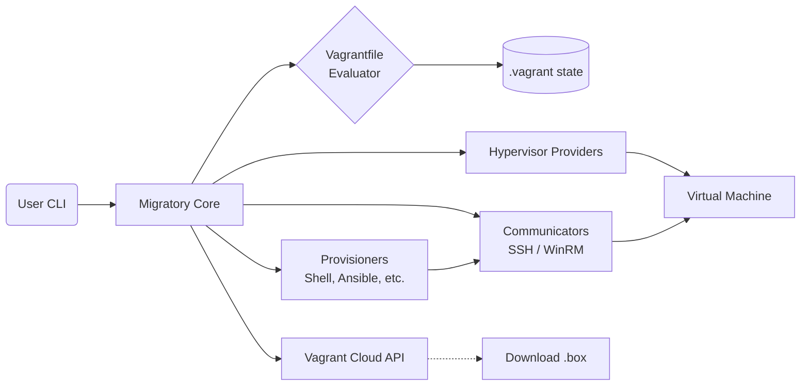

Migratory (Vagrant reimplementation; open-source)
=================================================

[](https://opensource.org/licenses/Apache-2.0)
[]()
[]()
[](https://github.com/SamuelMarks/migratory/actions)

**Migratory** is an open-source, 100% compatible replica of Vagrant (pre-BSL), written entirely in Rust. It aims to provide the exact same developer experience, CLI commands, and `Vagrantfile` compatibility as the original tool, but built on a modern, fast, and memory-safe foundation.

*Note: While **Migratory** is a reimplementation of Vagrant, if you are looking for an open-source reimplementation of Packer, please check out our sister project, [Stamp](https://github.com/SamuelMarks/stamp).*

## Vision

When Vagrant moved to the Business Source License (BSL), the open-source ecosystem needed a true, uncompromising alternative. Migratory is designed to be a drop-in replacement. If you have an existing `Vagrantfile`, Migratory should be able to parse it, provision it, and manage it—without requiring any changes to your project.

## Core Tenets

1. **Open Source Guarantee:** Released under the MIT license. It will remain free and open-source forever.
2. **100% Compatibility:** Flawless parsing and execution of standard, pre-BSL Ruby `Vagrantfile` definitions.
3. **Rust-Native Performance:** Faster startup times, concurrent provisioning, and memory-safe execution.
4. **Safe Execution Environment:** Strict enforcement of zero `.unwrap()`, `.expect()`, or panicking macros in core execution paths. All errors are properly modeled using a centralized `MigratoryError` enum.
5. **No Dependencies:** Statically compiled binaries for macOS, Linux, and Windows. No Ruby installation required on the host system.

## Key Features

* **Multi-Provider Support:** Architected to support VirtualBox, QEMU/libvirt (KVM), VMware, and Hyper-V out of the box.
* **Extensive Provisioning:** Support for `shell`, `file`, `ansible`, `chef`, `puppet`, and `docker` provisioners.
* **Synced Folders:** Native support for VirtualBox Shared Folders, `rsync`, NFS, and SMB.
* **Box Management:** Fully compatible with the Vagrant Cloud API for downloading, updating, and unpacking `.box` files.
* **Advanced Networking:** Automatic port collision detection, private (host-only) networks, and public (bridged) networking.
* **Plugin Architecture:** A robust Rust-native plugin registry for extending Migratory's capabilities.



## Getting Started

### Prerequisites
* Rust toolchain (1.70+)
* A supported hypervisor (e.g., VirtualBox, QEMU/KVM, or Hyper-V)

### Installation
Clone the repository and build from source:

```bash
git clone https://github.com/SamuelMarks/migratory.git
cd migratory
cargo build --release
```

The compiled binary will be located at `target/release/migratory`.

### Quick Start
To initialize a new project and boot an Ubuntu machine:

```bash
migratory init ubuntu/jammy64
migratory up
migratory ssh
```

For detailed command usage, please refer to the [USAGE.md](USAGE.md) file.
For insight into the project's internal design, see [ARCHITECTURE.md](ARCHITECTURE.md).

## Project Status

Migratory is currently in **active development**. The core architectural scaffolds, CLI router, configuration DSL definitions, and provider/provisioner traits have been established. We are currently actively filling out the remaining gaps vs the official Vagrant CLI, tracking our missing flags and commands in `TODO_PLAN.md` and `UNDERCOVERED.md`.

## Contributing

We enforce exceptionally strict code quality rules:
* **100% Documentation Coverage:** Every module, struct, trait, function, and argument must be documented.
* **100% Test Coverage:** Line, branch, and function coverage is enforced via CI (using `cargo-llvm-cov` or `tarpaulin`).
* **Zero Panics:** No `unwrap` or `expect`. Use `MigratoryError`.

Run the test suite locally before submitting a Pull Request:
```bash
cargo test
cargo clippy -- -D warnings -D clippy::unwrap_used
```

---

## License

Licensed under any of

- Apache License, Version 2.0 ([LICENSE-APACHE](LICENSE-APACHE) or
  <https://apache.org/licenses/LICENSE-2.0>)
- Creative Commons CC0, Version 1.0 [LICENSE-CC0](LICENSE-CC0) or <http://creativecommons.org/publicdomain/zero/1.0/>)
- MIT license ([LICENSE-MIT](LICENSE-MIT) or <https://opensource.org/licenses/MIT>)

at your option.

### Contribution

Unless you explicitly state otherwise, any contribution intentionally submitted
for inclusion in the work by you, as defined in the Apache-2.0 license, shall be
licensed as above, without any additional terms or conditions.
